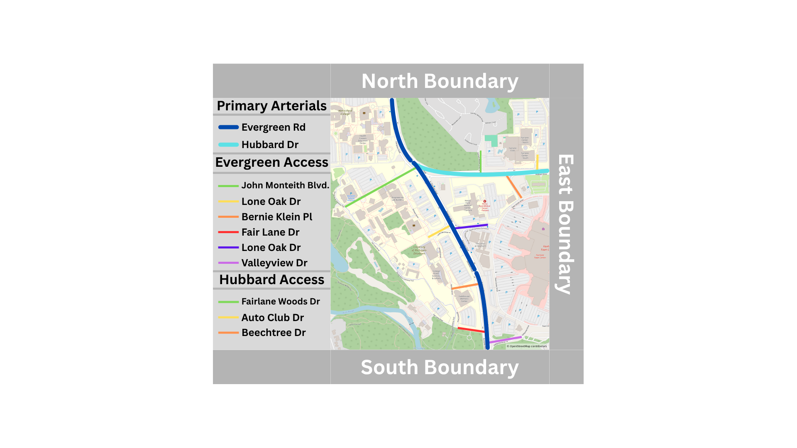

# UM-Dearborn ITE Sandbox 2026

Macroscopic traffic flow simulation of the University of Michigan–Dearborn corridor for the ITE Sandbox Competition 2026. The model couples a 4-step classic travel demand model (NCHRP 716) with a first-order LWR (Lighthill–Whitham–Richards) PDE solver to simulate 24-hour vehicle density and flow on two intersecting arterials.

---

## Table of Contents

1. [Corridor Overview](#1-corridor-overview)
2. [Repository Structure](#2-repository-structure)
3. [Theory](#3-theory)
4. [Quick Start](#4-quick-start)
5. [User Inputs Reference](#5-user-inputs-reference)
6. [Calibration Workflow](#6-calibration-workflow)
7. [Plot System](#7-plot-system)
8. [Data Files](#8-data-files)
9. [Function Reference](#9-function-reference)
10. [Units & Coordinate Conventions](#10-units--coordinate-conventions)


---

## 1. Corridor Overview

Two arterials are modeled as independent 1-D roads that share a T-intersection midway along Evergreen Rd.

| Road | Direction | Length | Speed Limit | Signal Location |
|------|-----------|--------|-------------|-----------------|
| Evergreen Rd Southbound (`SB`, idx 1) | North → South | 6 500 ft | 30–40 mph (variable) | x = 6 000 ft |
| Evergreen Rd Northbound (`NB`, idx 2) | South → North | 6 500 ft | 30–40 mph (variable) | x = 500 ft |
| Hubbard Rd Eastbound (`EB`, idx 3) | West → East | 4 500 ft | 45 mph | x = 4 200 ft |
| Hubbard Rd Westbound (`WB`, idx 4) | East → West | 4 500 ft | 45 mph | x = 4 200 ft |

All signals use a 45 s green / 75 s red cycle (120 s period) with a saturation flow of 1 900 veh/hr/lane.

### Traffic Analysis Zones (TAZs)

| Index | Name | Description |
|-------|------|-------------|
| 1 | MainCampus | UM-Dearborn campus (multiple access points on SB and NB) |
| 2 | ShoppingCenter | Retail area (single access point on SB and NB) |
| 3 | StudentHousing | On-campus housing (access on EB and WB) |
| 4 | NorthBoundary | External traffic entering/exiting from the north |
| 5 | SouthBoundary | External traffic entering/exiting from the south |
| 6 | EastBoundary | External traffic entering/exiting from the east |

Boundary zones (4–6) represent the external network and are the primary calibration targets against MDOT truth data.

### MDOT AADT Truth Data (2021–2025)

| Road | AADT [veh/day] |
|------|---------------|
| Evergreen SB | 2 518 |
| Evergreen NB | 3 042 |
| Hubbard EB | 7 280 |
| Hubbard WB | 4 497 |

---

## 2. Repository Structure

```
UM_dearborn_ITESandbox2026/
├── UM_dearborn_ITESandbox2026_V05.m   # Main script — run this file
├── LWRModel.m                         # LWR finite-volume solver
├── ClassicTrafficDemandModel.m        # 4-step travel demand model
├── MdotTruthData.m                    # MDOT AADT truth data loader
├── EvergreenRdSouthbound.m            # Road constructor (SB)
├── EvergreenRdNorthbound.m            # Road constructor (NB)
├── HubbardRdEastbound.m               # Road constructor (EB)
├── HubbardRdWestbound.m               # Road constructor (WB)
├── HouseholdData.xlsx                 # Trip production inputs (Step 1)
├── TripRateData.xlsx                  # Trip rate & attraction inputs (Steps 1–2)
└── NCHRP716.pdf                       # Reference: 4-step demand model guidance
```

---

## 3. Theory

### 3.1 LWR Traffic Flow Model

The model solves the conservation equation for vehicle density ρ [veh/ft/lane]:

```
∂ρ/∂t + ∂F/∂x = s(x,t)
```

where `F` is traffic flow [veh/s] and `s` is a source/sink term from the demand model [veh/s/ft].

**Greenshields Fundamental Diagram:**
```
F(ρ, vf) = vf · ρ · (1 − ρ / ρ_j)
```
- `ρ_j = 1/18` veh/ft/lane (jam density)
- `ρ_c = ρ_j / 2` (critical density at capacity)
- `vf` varies by segment (30–45 mph)

**Godunov Numerical Scheme** (first-order upwind finite volume):
```
ρᵢⁿ⁺¹ = ρᵢⁿ + (Δt/Δx)(Fᵢⁿ − Fᵢ₊₁ⁿ + sᵢⁿ)
```
Intercell fluxes use the Godunov supply–demand formulation: `F = N_lanes · min(D(ρ_up), S(ρ_down))`.

**Signal gating:** At the signal cell, flux is further capped at `g(t) · Q_sat` where `g ∈ {0,1}` is the green/red phase indicator.

**Simulation parameters:**
- `Δt = 1 s`, `Δx = 500 ft` → CFL satisfied for speeds up to 500 ft/s
- Total duration: 24 hours (86 400 time steps in full mode)

### 3.2 4-Step Classic Travel Demand Model

Implemented following NCHRP 716. All four steps run before the LWR solver.

| Step | Method | Key Parameters |
|------|--------|----------------|
| 1a — Trip Generation (Productions) | Cross-classification: `P_i = Σ H_i(a,s) · R_i(a,s)` | `HouseholdData.xlsx`, `TripRateData.xlsx` |
| 1b — Trip Generation (Attractions) | Linear land-use: `A_j = 1.5·Employment + 0.4·Enrollment + 0.01·RetailArea` | `AttractionParameters` sheet in `TripRateData.xlsx` |
| 1c — P/A Balance | Scale attractions: `A ← A · (ΣP / ΣA)` | Conservation constraint |
| 2 — Trip Distribution | Singly-constrained gravity model with friction `F_ij = exp(−β·t_ij)` | `β = 0.12 /min`, `v_avg = 35 mph`; gravity optionally disabled |
| 3 — Mode Choice | Average vehicle occupancy: `T_vehicle = T_person / 1.25` | `auto_occupancy = 1.25 persons/veh` |
| 4 — Network Loading | OD access matrices (6×6 per road) map vehicle trips to corridor flows | Road-specific binary access matrices |

**Output:** `demand.V_taz_depart(road, taz)` and `demand.V_taz_arrive(road, taz)` — daily vehicle volumes [veh/day] at each road–TAZ interface.

**Temporal profiles:** Daily volumes are distributed across 24 hours using Gaussian profiles parameterized by `TAZ.peak_depart/arrive` and `TAZ.sigma_depart/arrive`. The normalized hourly fraction `f(h)` converts daily volumes to per-second rates within `LWRModel`.

---

## 4. Quick Start

**Requirements:** MATLAB R2020b or later (uses `exportgraphics`, `sgtitle`, `tiledlayout`-compatible `findall`).

1. Open MATLAB and set the working directory to this repository folder.
2. Open `UM_dearborn_ITESandbox2026_V05.m`.
3. Set `sim.mode`:
   - `'demand_only'` — runs in ~seconds; skips the LWR solver; outputs the boundary tuning console report and demand plots. **Use this mode for calibration.**
   - `'full'` — runs the complete 24-hour LWR simulation (~5–60 s depending on hardware). Required for space-time, signal, and conservation plots.
4. Press **Run** (F5).
5. Read the console **Boundary Tuning Report** to see OD model vs MDOT AADT.
6. Adjust `QUICKTUNE` scale factors and re-run in `demand_only` mode until errors are acceptable.

---

## 5. User Inputs Reference

All user inputs are in the `%% USER INPUTS (EDIT HERE)` section at the top of the main script. **Do not edit sections below that line.**

### 5.1 Simulation Settings

```matlab
sim.dt   = 1;              % [s] time step
sim.dx   = 500;            % [ft] spatial cell size
sim.T_end = 24*3600;       % [s] simulation duration
sim.mode = 'demand_only';  % 'demand_only' | 'full'
```

### 5.2 Quick Tune — Boundary Scale Factors

Multiplies specific OD model boundary flows **without editing the spreadsheets**. Each factor scales one road–direction boundary.

```matlab
QUICKTUNE.SB_in  = 1.0;   % NorthBoundary departures  → Evergreen SB upstream
QUICKTUNE.SB_out = 1.0;   % Evergreen SB downstream   → SouthBoundary arrivals
QUICKTUNE.NB_in  = 1.0;   % SouthBoundary departures  → Evergreen NB upstream
QUICKTUNE.NB_out = 1.0;   % Evergreen NB downstream   → NorthBoundary arrivals
QUICKTUNE.EB_in  = 1.0;   % Intersection departures   → Hubbard EB (all external TAZs)
QUICKTUNE.EB_out = 1.0;   % Hubbard EB downstream     → EastBoundary arrivals
QUICKTUNE.WB_in  = 1.0;   % EastBoundary departures   → Hubbard WB upstream
QUICKTUNE.WB_out = 1.0;   % Hubbard WB downstream     → Intersection arrivals (all external TAZs)
```

> The console **Boundary Tuning Report** prints a `Rec. Scale` column. Paste those values in, re-run, and the column should converge toward `1.000`.

### 5.3 Fundamental Diagram

```matlab
FD.rho_j = 1/18;   % [veh/ft/lane] jam density (~293 veh/mile/lane)
FD.rho_c = FD.rho_j/2;
FD.Q = @(rho, vf) vf .* rho .* (1 - rho/FD.rho_j);
```

### 5.4 TAZ Temporal Parameters

Control the shape of each zone's hourly departure/arrival profile (single Gaussian peak).

```matlab
TAZ.peak_arrive  = [14, 14, 14, 16, 16, 14];  % [hr] peak hour per TAZ (1-indexed)
TAZ.sigma_arrive = [ 4,  4,  4,  4,  4,  5];  % [hr] spread
TAZ.peak_depart  = [14, 14, 14, 16, 16, 14];
TAZ.sigma_depart = [ 4,  4,  4,  4,  4,  5];
```

The console **TAZ Temporal Parameter Recommendations** block prints weighted-mean and standard-deviation estimates computed directly from the MDOT hourly distributions — use these as targets for the parameters above.

### 5.5 Access Points

Each `TAZ.AccessPoints` entry attaches a TAZ to a road at one or more physical driveway locations. The `split` vector (must sum to 1.0) distributes the TAZ's daily volume across multiple driveways.

```matlab
TAZ.AccessPoints(n).taz_idx  = k;       % index into TAZ.names
TAZ.AccessPoints(n).roadName = road.name;
TAZ.AccessPoints(n).xLocal   = [...];   % [ft] driveway positions
TAZ.AccessPoints(n).split    = [...];   % fractional volume per driveway
```

### 5.6 Road Constructors

Each road is configured inside its own file (`EvergreenRdSouthbound.m`, etc.). Parameters that may need tuning:

| Parameter | Location in constructor | Description |
|-----------|------------------------|-------------|
| `road.N_lanes` | per-segment array | Number of lanes by position |
| `road.signal.x` | scalar [ft] | Signal location along road |
| `road.signal.green/red` | [s] | Signal phase durations |
| `road.signal.Qsat_per_lane` | [veh/s/lane] | Saturation flow rate |
| `road.boundary_idx` | `[inflow_taz, outflow_taz]` | Links road ends to TAZ indices; `0` = intersection (no explicit BC) |

### 5.7 Spreadsheet Inputs

| File | Sheet(s) | Content |
|------|----------|---------|
| `HouseholdData.xlsx` | MainCampus, ShoppingCenter, StudentHousing, NorthBoundary, SouthBoundary, EastBoundary | Household cross-classification matrix H(auto-ownership, household-size) per zone |
| `TripRateData.xlsx` | Same 6 zone sheets + `AttractionParameters` | Trip rate matrix R(auto-ownership, household-size); attraction parameters (Employment, Enrollment, RetailArea) per zone |

Row/column headers are stripped automatically; the model reads only the numeric data block.

---

## 6. Calibration Workflow

### Step 1 — Demand-Only Calibration

Set `sim.mode = 'demand_only'` and `plots.demand_boundary = true`.

Run the script. The console prints:

```
========== Boundary Tuning Report ==========
Road  Dir  Boundary TAZ     MDOT[v/d]  RawOD[v/d]  QT Scale  Scaled[v/d]  Error%  Rec.Scale
------------------------------------------------------------------------------------------
SB    In   NorthBoundary        2518        843     1.000          843      -66.5%    2.988
...
```

- **RawOD** — what the OD model produces with all `QUICKTUNE = 1.0`
- **QT Scale** — the factor currently applied
- **Scaled** — what is actually being used (`RawOD × QT Scale`)
- **Error%** — deviation of Scaled from MDOT
- **Rec. Scale** — the additional multiplier needed to reach MDOT (`MDOT / Scaled`)

Copy the `Rec. Scale` values into the corresponding `QUICKTUNE` fields and re-run. Iterate until `Rec. Scale ≈ 1.000` for all boundaries.

### Step 2 — Temporal Profile Calibration

The console also prints:

```
========== TAZ Temporal Parameter Recommendations ==========
  SB: peak_arrive=14.3 h, sigma_arrive=3.1 h | peak_depart=14.3 h, sigma_depart=3.1 h
  ...
```

Update `TAZ.peak_arrive/depart` and `TAZ.sigma_arrive/depart` to match these values.

### Step 3 — Spreadsheet Calibration (Permanent Adjustments)

For adjustments that should be persistent and not require `QUICKTUNE` overrides, modify `HouseholdData.xlsx` (household counts by cross-classification) or `TripRateData.xlsx` (trip rates or attraction parameters). Reset the relevant `QUICKTUNE` factor to `1.0` after updating the spreadsheet.

### Step 4 — Full Simulation Validation

Set `sim.mode = 'full'` and enable `plots.tuning_boundary = true` and `plots.tuning_conservation = true`. Verify that simulated boundary flows match MDOT truth and that daily trip totals are conserved across the network.

---

## 7. Plot System

### 7.1 Plot Switchboard

All plot flags live in the `%% Configure Plot Output` section.

| Flag | Mode | Description |
|------|------|-------------|
| `plots.demand_boundary` | both | Hourly OD boundary profile vs MDOT truth — one figure per road |
| `plots.tuning_boundary` | full only | Simulated hourly boundary flow vs OD desired vs MDOT — 2×3 subplot per road |
| `plots.tuning_conservation` | full only | Daily trip conservation across all 4 roads |
| `plots.space_time` | full only | Space-time vehicle density diagram |
| `plots.signal_timing` | full only | Signal phase diagram (green/red bands) |
| `plots.source_sink` | full only | Net source/sink time series per access point |
| `plots.od_matrix` | both | OD vehicle trip matrix heatmap |
| `plots.road_geometry` | both | Road segment geometry and lane count diagram |
| `plots.road_SB/NB/EB/WB` | — | Per-road enable for space_time, signal_timing, source_sink, road_geometry |

### 7.2 Plot Formatting

The `plotfmt` struct controls all figure appearance. Typical settings for a technical report:

```matlab
plotfmt.font       = 'Arial';    % or 'Times New Roman'
plotfmt.sgtitle_fs = 13;         % super-title font size [pt]
plotfmt.title_fs   = 11;         % subplot title [pt]
plotfmt.label_fs   = 10;         % axis labels [pt]
plotfmt.tick_fs    = 9;          % tick labels [pt]
plotfmt.legend_fs  = 8;          % legend [pt]
plotfmt.lw         = 1.5;        % line width [pt]
plotfmt.ms         = 4;          % marker size [pt]
plotfmt.ax_box     = 'on';       % axis border ('on' | 'off')
plotfmt.tick_dir   = 'in';       % tick direction ('in' | 'out')
```

Figure physical sizes (inches) are set per layout type:

| Field | Default | Used by |
|-------|---------|---------|
| `sz_wide` | `[12, 4.5]` | `demand_boundary` (1×3) |
| `sz_tall` | `[14, 6.5]` | `tuning_boundary` (2×3) |
| `sz_half` | `[10, 4.0]` | `tuning_conservation` (1×2) |
| `sz_single` | `[7, 5.0]` | space-time, OD matrix |
| `sz_stack` | `[7, 8.0]` | source/sink stacked panels |

### 7.3 PNG Export

```matlab
plotfmt.export     = true;       % enable auto-export
plotfmt.dpi        = 300;        % dots per inch
plotfmt.export_dir = 'figures';  % folder (created automatically)
```

When enabled, every generated figure is saved as `figures/<figure_name>.png` immediately after creation.

---

## 8. Data Files

### HouseholdData.xlsx

Six sheets (one per TAZ). Each sheet is a cross-classification matrix:
- **Rows:** household size categories
- **Columns:** auto-ownership categories
- **Values:** number of households in each cell

`ClassicTrafficDemandModel` reads the numeric block only (headers and row/column totals are stripped).

### TripRateData.xlsx

Six zone sheets plus an `AttractionParameters` sheet.

- **Zone sheets:** Trip rate matrix (same row/column structure as HouseholdData)
- **AttractionParameters sheet:** One row per zone, three columns: `[Employment, Enrollment, RetailArea]`

Trip productions: `P_i = Σ H_i(a,s) · R_i(a,s)` (element-wise product, summed over all cells).
Attractions: `A_j = 1.5·Jobs + 0.4·Students + 0.01·RetailSqFt`.

---

## 9. Function Reference

### `UM_dearborn_ITESandbox2026_V05.m` — Main Script

Entry point. Configures all inputs, runs the demand model, optionally runs the LWR solver, and generates plots. Contains all user-editable parameters in the labeled USER INPUTS section.

**Execution flow:**
1. Set simulation parameters and `QUICKTUNE` factors
2. Construct Fundamental Diagram and road objects
3. Configure TAZs, access points, and intersections
4. Run `ClassicTrafficDemandModel` → apply `QUICKTUNE` → load MDOT truth
5. If `sim.mode == 'full'`: run LWR solver loop (86 400 steps)
6. Restore state matrices → compute Hubbard `F_desired` post-loop
7. Console reports → plots

---

### `LWRModel(road, rho_n, demand, zone, sim)` → `[rho_next, F_n, F_n_desired, g_n, g_eff_n, s_n]`

First-order Godunov finite-volume solver for one road, one time step.

| Input | Type | Description |
|-------|------|-------------|
| `road` | struct | Road geometry (lean — no large state arrays) |
| `rho_n` | `Nx×1` | Current density column [veh/ft/lane] |
| `demand` | struct | OD model output (`V_taz_depart`, `V_taz_arrive`) |
| `zone` | struct | TAZ temporal profiles (`f_depart`, `f_arrive`) |
| `sim` | struct | Time step metadata (`dt`, `dx`, `n`, `h`) |

| Output | Type | Description |
|--------|------|-------------|
| `rho_next` | `Nx×1` | Updated density [veh/ft/lane] |
| `F_n` | `(Nx+1)×1` | Cell-face fluxes [veh/s] |
| `F_n_desired` | `2×1` | Unconstrained OD boundary demands [veh/s] (for diagnostics) |
| `g_n` | scalar | Signal phase at this step (1=green, 0=red) |
| `g_eff_n` | `Nx×1` | Per-cell effective green (non-zero only at signal cell) |
| `s_n` | `Nx×1` | Net source/sink per cell [veh/s] |

**Boundary conditions:**
- `boundary_idx(1) != 0`: upstream inflow = `min(OD demand, supply capacity)`
- `boundary_idx(1) == 0`: no upstream BC (intersection origin — flow enters via source/sink)
- Downstream: free outflow (demand-limited)

---

### `ClassicTrafficDemandModel(zone)` → `demand`

Runs all four steps of the travel demand model and returns daily vehicle volumes.

**Key outputs:**

| Field | Size | Description |
|-------|------|-------------|
| `demand.P` | `1×6` | Trip productions [person-trips/day] per zone |
| `demand.A` | `6×1` | Balanced trip attractions [person-trips/day] |
| `demand.T_vehicle` | `6×6` | OD vehicle trip matrix [veh/day] |
| `demand.V_taz_depart` | `4×6` | Daily departures [veh/day] per road–TAZ pair |
| `demand.V_taz_arrive` | `4×6` | Daily arrivals [veh/day] per road–TAZ pair |

`V_taz_depart(r, k)` = total vehicles that depart from TAZ `k` via road `r` each day.

---

### `MdotTruthData(roadway)` → `truth`

Returns MDOT AADT truth data for a named roadway.

| Output | Size | Description |
|--------|------|-------------|
| `truth.MDOT_inflow` | `1×24` | Hourly inflow rate [veh/s] |
| `truth.MDOT_outflow` | `1×24` | Hourly outflow rate [veh/s] |

AADT × normalized hourly distribution / 3600. Inflow equals outflow (conservation assumption).

---

### Road Constructors: `EvergreenRdSouthbound`, `EvergreenRdNorthbound`, `HubbardRdEastbound`, `HubbardRdWestbound`

Each returns a `road` struct. **Signature:** `road = RoadName(sim, FD)`

**road struct fields:**

| Field | Description |
|-------|-------------|
| `road.name` | Display name string |
| `road.idx` | Road index (1–4) |
| `road.length` | Total length [ft] |
| `road.Nx` | Number of cells (`length / sim.dx`) |
| `road.x_edges` | Cell boundary positions [ft] |
| `road.x_centers` | Cell center positions [ft] |
| `road.N_lanes` | `1×Nx` lane count per cell |
| `road.boundary_idx` | `[inflow_taz, outflow_taz]` (0 = intersection) |
| `road.signal` | Signal config: `x`, `green`, `red`, `Qsat_per_lane`, `cell`, `period`, `Qsat` |
| `road.is_signal` | `1×Nx` boolean: true at signal cell |
| `road.FD` | Fundamental diagram with per-cell `vf` |
| `road.rho` | `Nx×Nt` density state [veh/ft/lane] |
| `road.F` | `(Nx+1)×Nt` flux state [veh/s] |
| `road.F_desired` | `2×Nt` unsaturated OD boundary demands [veh/s] |
| `road.g` | `1×(Nt-1)` signal phase history |
| `road.g_eff` | `Nx×(Nt-1)` effective green per cell |
| `road.s` | `Nx×Nt` net source/sink [veh/s] |
| `road.Truth` | MDOT truth struct (attached after `MdotTruthData`) |
| `road.AccessPoints` | Array of access point structs (attached by `mapAccessPoints`) |
| `road.intersection` | Intersection struct (attached by `mapIntersectionPoints`) |

---

### Helper Functions (local, bottom of main script)

| Function | Description |
|----------|-------------|
| `hourIndex(t)` | Converts time [s] → 1-based hour index [1..24] |
| `parametricPeaks(params)` | Builds a 24-element raw Gaussian hourly profile from `w`, `mu`, `sigma` |
| `mapAccessPoints(road, TAZ)` | Assigns TAZ access point locations to road segment indices |
| `mapIntersectionPoints(road, intersection)` | Assigns intersection locations to road segment indices |
| `applyFigureFormat(fig, sz, plotfmt)` | Sets figure size [inches] and applies uniform font/axes formatting |
| `exportFigure(fig, name, plotfmt)` | Saves figure as PNG if `plotfmt.export == true` |
| `plotRoadGeometry(sim, road, ...)` | Renders road geometry with lanes, signal, and access point annotations |

---

## 10. Units & Coordinate Conventions

| Quantity | Unit |
|----------|------|
| Length / position | feet [ft] |
| Time | seconds [s] |
| Speed | ft/s internally; mph in user inputs (converted via `sim.mph_to_fts`) |
| Density | veh/ft/lane |
| Flow | veh/s |
| Daily volume | veh/day |
| Hourly volume | veh/hr |

**Global coordinate frame:**
- `x = 0` — north end of Evergreen Rd
- `x = 6 500 ft` — south end of Evergreen Rd
- `y = 0` — west end of Hubbard Rd (Evergreen intersection)
- `y = 4 500 ft` — east end of Hubbard Rd

**Local road frame:** each road's `x = 0` is at its inflow boundary.

- SB: x=0 at north; x=6 500 at south
- NB: x=0 at south; x=6 500 at north
- EB: x=0 at west (intersection); x=4 500 at east
- WB: x=0 at east; x=4 500 at west (intersection)

---

*ITE Sandbox Competition 2026 — University of Michigan–Dearborn*
